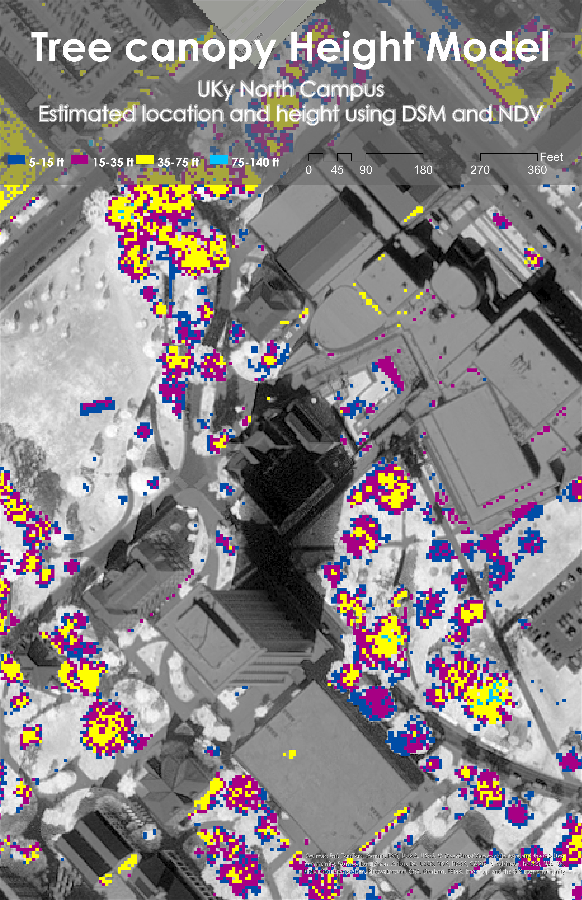

# Kentucky Field Trip Maps

## Tree Canopy and Land Cover Analysis

**Published by:** Ryan Zuber
**Date:** March 2025

### **Overview**
This project provides georeferenced maps for a field trip focused on tree canopy coverage and land cover analysis in Kentucky. The maps are available in both **JPEG for web preview** and **Geospatial PDF for mobile use in Avenza Maps**.

---

## **Kentucky Land Cover Map**
This map displays selected land cover types across Kentucky.

**Preview:**

**Download PDF:**
[Download Kentucky Land Cover Map (PDF)](kylandcover.pdf)

---

## **UKy Central Campus Canopy Model**
This map visualizes the canopy model for the University of Kentucky’s central campus.

**Preview:**

**Download PDF:**
[Download UKy Canopy Model (PDF)](TreeCanopy.pdf)

---

### **Map Features**
- **Legend**: Displays symbology for main layers.
- **Scale Bar**: Shows distance for reference.
- **Data Sources**: See below.

---

### **Data Sources**
The analysis was conducted using GIS datasets, including:

- **Land Cover Data**: Extracted from remote sensing sources and state GIS databases.
- **Canopy Model Data**: Derived from LiDAR and aerial imagery.
- **Base Layers**: County boundaries, road networks, and elevation data.

These maps are designed for use in **Avenza Maps** to assist field trip participants in geolocating their observations.

---
